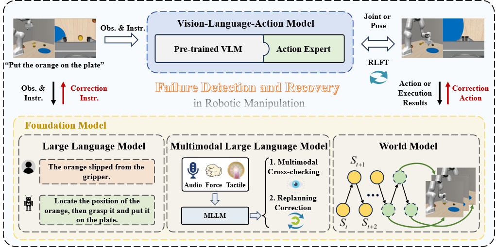
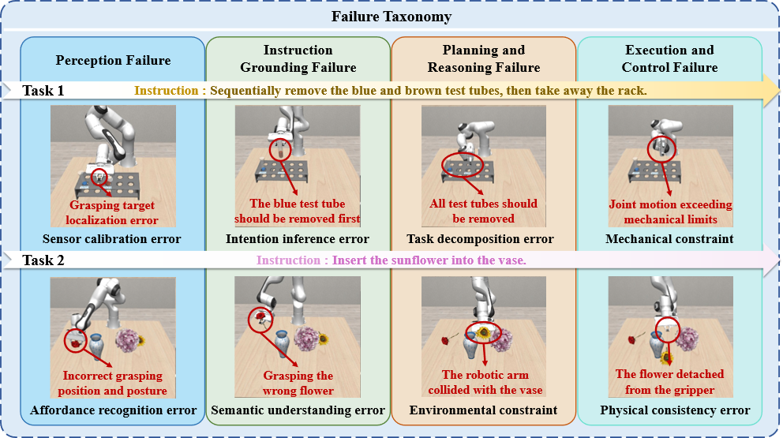
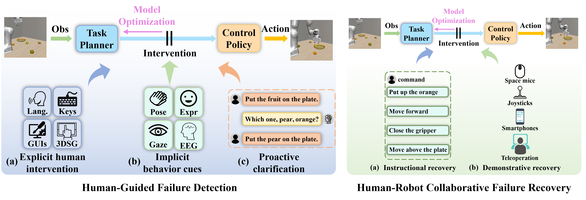
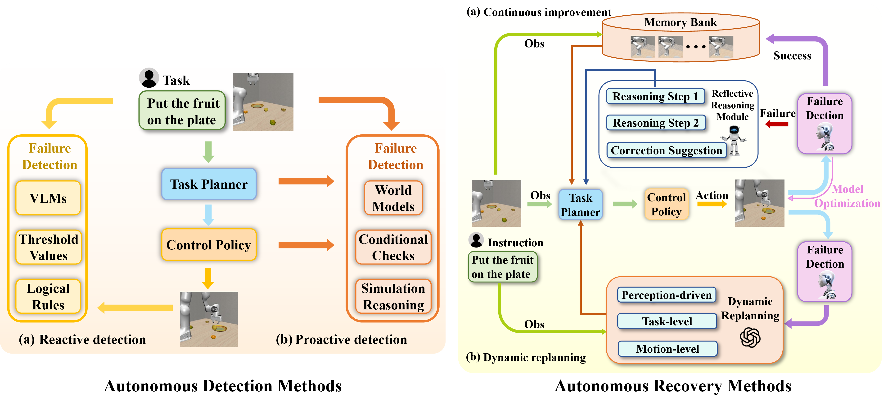
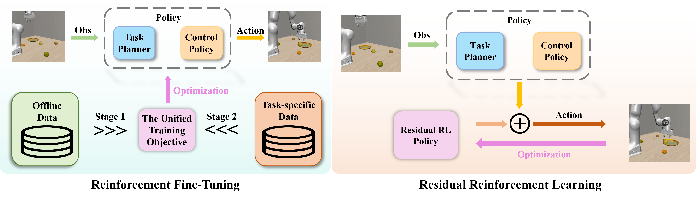
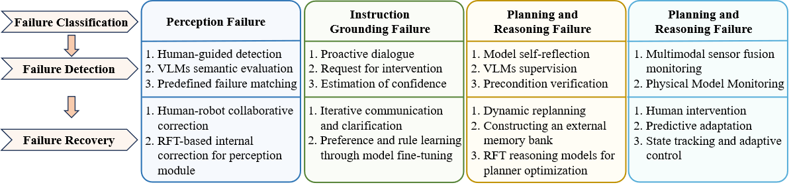

<h1 align="center"><strong>Towards Robust Robotic Manipulation: A Survey on Failure Detection and Recovery in the Era of Foundation Model</strong></h1>
A curated collection of seminal papers, codebases, datasets and benchmarks in the field of failure detection and recovery, continuously updated.

## 📖 Content

1. [Introduction](#intro)
2. [Failure Classification](#classification)
3. [Methods](#method)
4. [Datasets and Benchmarks](#dataset)
5. [Updates](#updates)
6. [Call for Contribution](#call)
7. [Citation](#refer)
8. [Acknowledgement](#acknowledgement)

## 🏠 <a name="intro"></a> Introduction

Recent advancements in foundation models have significantly enhanced the capabilities of robots in reasoning, decision-making, and task execution, enabling them to handle complex, unstructured tasks. However, these models also introduce new failure modes, particularly in robotic manipulation. As robots shift from deterministic systems to those driven by foundation models, issues like hallucinations, lack of physical commonsense, and semantic misinterpretations can lead to failures in perception, grounding, planning, and execution. These cognitive-level failures increase uncertainty in task outcomes, highlighting the need for better failure detection and recovery mechanisms.

Foundation models are key in detecting and correcting failures in robotic systems. They enhance robots' understanding and reasoning, helping identify discrepancies between expected and actual outcomes. LLMs and MLLMs enable semantic verification and task re-planning, while Vision-Language-Action Models (VLAs) can correct movements in real-time. World models can proactively prevent failures by simulating and evaluating recovery strategies.


## 📄 <a name="classification"></a>  Failure Classification


As foundation models are increasingly integrated into robotic manipulation, failures are no longer limited to execution errors but also encompass cognitive and semantic failures arising from stages such as perception, grounding, planning, and reasoning. To address these challenges, this paper introduces a hierarchical failure classification framework that aligns with the perception-grounding-planning-execution pipeline.
> Tips: The table below may not be displayed completely, **scroll right** to see more~

| Paper | Published in | Code/Project |
| ------------- | :-----:| :-----:|
| [Reflect: Summarizing Robot Experiences for Failure Explanation and Correction](https://arxiv.org/pdf/2306.15724) | CoRL 2023 | [Project](https://robot-reflect.github.io/) |
| [Condition Monitoring and Fault Diagnosis of Industrial Robots: A Review](https://link.springer.com/article/10.1007/s11431-024-2810-2) | Science China Technological Sciences 2025 | - |
| [Dadu-E: Rethinking the Role of Large Language Model in Robotic Computing Pipeline](https://arxiv.org/pdf/2412.01663.pdf) | arXiv 2024 | [Project](https://rlc-lab.github.io/dadu-e/) |
| [Can’t Touch This: Real-Time, Safe Motion Planning and Control for Manipulators Under Uncertainty](https://ieeexplore.ieee.org/abstract/document/11059838/) | IEEE T-RO 2025 |  [Project](https://roahmlab.github.io/armour/)|
| [ReMac: Self-Reflective and Self-Evolving Multi-Agent Collaboration for Long-Horizon Robot Manipulation](https://arxiv.org/pdf/2503.22122.pdf) | arXiv 2025 | - |
| [Robot Error Awareness Through Human Reactions: Implementation, Evaluation, and Recommendations](https://arxiv.org/pdf/2501.05723.pdf) | arXiv 2025 | - |
| [Distilling and Retrieving Generalizable Knowledge for Robot Manipulation via Language Corrections](https://ieeexplore.ieee.org/abstract/document/10610455) | ICRA 2024 | [Project](https://sites.google.com/stanford.edu/droc) |
| [Robotic Manipulation via Imitation Learning: Taxonomy, Evolution, Benchmark, and Challenges](https://arxiv.org/pdf/2508.17449.pdf) | arXiv 2025 | - |
| [Reinforcement Learning in Robotics: A Survey](https://journals.sagepub.com/doi/pdf/10.1177/0278364913495721) | IJRR 2013 | - |
| [Reflexion: Language Agents with Verbal Reinforcement Learning](https://arxiv.org/pdf/2303.11366.pdf) | NeurIPS 2023 | [Project](https://github.com/noahshinn024/reflexion) |
| [TidyBot: Personalized Robot Assistance with Large Language Models](https://arxiv.org/pdf/2305.05658.pdf) | Autonomous Robots 2023 | [Project](https://github.com/google-research/tidybot) |
| [Talk-to-Resolve: Combining Scene Understanding and Spatial Dialogue to Resolve Granular Task Ambiguity for a Collocated Robot](https://www.sciencedirect.com/science/article/pii/S0921889022001077) | RAS 2022 | - |
| [Raider: Tool-Equipped Large Language Model Agent for Robotic Action Issue Detection, Explanation and Recovery](https://arxiv.org/pdf/2503.17703.pdf) | arXiv 2025 | [Project](https://eurecat.github.io/raider-llmagent/) |
| [RACER: Rich Language-Guided Failure Recovery Policies for Imitation Learning](https://arxiv.org/pdf/2409.14674.pdf) | arXiv 2024 | [Project](https://rich-language-failure-recovery.github.io/) |
| [Rethinking the Bias of Foundation Model Under Long-Tailed Distribution](https://arxiv.org/pdf/2501.15955) | ICML 2025 | - |
| [I-FailSense: Towards General Robotic Failure Detection with Vision-Language Models](https://arxiv.org/pdf/2509.16072.pdf) | arXiv 2025 | [Project](https://clemgris.github.io/I-FailSense/) |
| [A Survey of Robotic Language Grounding: Tradeoffs Between Symbols and Embeddings](https://arxiv.org/pdf/2405.13245) | IJCAI 2024 | - |
| [RePlan: Robotic Replanning with Perception and Language Models](https://arxiv.org/pdf/2401.04157.pdf) | arXiv 2024 | [Project](https://github.com/aspuru-guzik-group/replan) |
| [Do As I Can, Not As I Say: Grounding Language in Robotic Affordances](https://arxiv.org/pdf/2204.01691.pdf) | arXiv 2022 | [Project](https://github.com/google-research/robotics_transformer) |
| [Recover: A Neuro-Symbolic Framework for Failure Detection and Recovery](https://ieeexplore.ieee.org/abstract/document/10801853) | IROS 2024 | [Project](https://recover-ontothor.github.io) |
| [Code-as-Monitor: Constraint-Aware Visual Programming for Reactive and Proactive Robotic Failure Detection](https://openaccess.thecvf.com/content/CVPR2025/papers/Zhou_Code-as-Monitor_Constraint-Aware_Visual_Programming_for_Reactive_and_Proactive_Robotic_Failure_Detection_CVPR_2025_paper.pdf) | CVPR 2025 | [Project](https://zhoues.github.io/Code-as-Monitor) |


## 🤖 <a name="method"></a> Methods
We categorize existing failure detection and recovery methods into three core paradigms: Human-in-the-Loop (HITL), Model-in-theLoop (MITL), and Reinforcement Fine-Tuning (RFT). 

### Human in the Loop


HITL mechanism involves human operators providing judgment and corrective actions during failure detection and recovery in autonomous systems. These methods are especially useful in dynamic, unstructured environments where the systems may lack adequate reasoning or commonsense knowledge.
> Tips: The table below may not be displayed completely, **scroll right** to see more~

| Paper | Published in | Code/Project |
| ------------- | :-----:| :-----:|
| [RACER: Rich Language-Guided Failure Recovery Policies for Imitation Learning](https://arxiv.org/pdf/2409.14674.pdf) | arXiv 2024 | [Project](https://rich-language-failure-recovery.github.io/) |
| [Rethinking the Bias of Foundation Model Under Long-Tailed Distribution](https://arxiv.org/pdf/2501.15955) | ICML 2025 | - |
| [I-FailSense: Towards General Robotic Failure Detection with Vision-Language Models](https://arxiv.org/pdf/2509.16072.pdf) | arXiv 2025 | [Project](https://clemgris.github.io/I-FailSense/) |
| [A Survey of Robotic Language Grounding: Tradeoffs Between Symbols and Embeddings](https://arxiv.org/pdf/2405.13245) | IJCAI 2024 | - |
| [A Review of Robot Learning for Manipulation: Challenges, Representations, and Algorithms](https://www.jmlr.org/papers/v22/19-804.html) | JMLR 2021 | - |
| [Real-Time Detection of Robot Failures Using Gaze Dynamics in Collaborative Tasks](https://ieeexplore.ieee.org/abstract/document/10973922) | HRI 2025 | - |
| [Human-in-the-loop Robot Learning for Smart Manufacturing: A Human-Centric Perspective](https://ieeexplore.ieee.org/abstract/document/10836893) | IEEE Trans. on Automation Science and Engineering 2025 | - |
| [Real-Time Out-of-Distribution Failure Prevention via Multi-Modal Reasoning](https://arxiv.org/pdf/2505.10547) | RSS Workshop 2025 | [Project](https://milanganai.github.io/fortress) |
| [GRAPE: Generalizing Robot Policy Via Preference Alignment](https://arxiv.org/pdf/2411.19309) | ICRA 2025 Workshop | - |
| [Interactive Imitation Learning in Robotics: A Survey](https://www.nowpublishers.com/article/Details/ROB-072) | Foundations and Trends® in Robotics 2022 | - |
| [Don’t Yell at Your Robot: Physical Correction as the Collaborative Interface for Language Model Powered Robots](https://arxiv.org/pdf/2412.12602.pdf) | arXiv 2024 | - |
| [RoboCopilot: Human-in-the-loop Interactive Imitation Learning for Robot Manipulation](https://arxiv.org/pdf/2503.07771.pdf) | arXiv 2025 | - |
| [Yell at Your Robot: Improving On-the-Fly from Language Corrections](https://arxiv.org/pdf/2403.12910.pdf) | arXiv 2024 | [Project](https://yay-robot.github.io/) |
| [Interactive Robot Learning from Verbal Correction](https://arxiv.org/pdf/2310.17555) | LA@R Workshop 2023 | [Project](https://ut-austin-rpl.github.io/olaf/) |
| [Learning to Learn Faster from Human Feedback with Language Model Predictive Control](https://arxiv.org/pdf/2402.11450) | ICRA Workshop 2024 | [Project](https://robot-teaching.github.io/) |
| [SYNERGAI: Perception Alignment for Human-Robot Collaboration](https://arxiv.org/pdf/2409.15684) | ICRA 2025 | [Project](https://synerg-ai.github.io/) |
| [Online Imitation Learning for Manipulation via Decaying Relative Correction](https://arxiv.org/pdf/2503.15368.pdf) | arXiv 2025 | - |
| [Head and Shoulders: Automatic Error Detection in Human-Robot Interaction](https://dl.acm.org/doi/10.1145/3136755.3136785) | ACM ICMI 2017 | - |
| [Correcting Robot Mistakes in Real Time Using EEG Signals](https://ieeexplore.ieee.org/document/7989777) | ICRA 2017 | [Video](http://people.csail.mit.edu/delpreto/icra2017eeg) |
| [Learning to Share Autonomy Across Repeated Interaction](https://arxiv.org/pdf/2107.09650) | IROS 2021 | [Video](https://youtu.be/Plh4t3wQeIA) |
| [Human-in-the-loop Task and Motion Planning for Imitation Learning](https://arxiv.org/pdf/2310.16014) | CoRL 2023 | [Project](https://hitltamp.github.io/) |
| [Robots That Ask for Help: Uncertainty Alignment for LLM Planners](https://arxiv.org/pdf/2307.01928) | CoRL 2023 | [Project](https://robot-help.github.io/) |
| [RT-H: Action Hierarchies Using Language](https://arxiv.org/pdf/2403.01823) | RSS 2024 | [Project](https://rt-hierarchy.github.io/) |
| [Enhancement of Long Horizon Task Planning via Active and Passive Modification in Large Language Models](https://www.nature.com/articles/s41598-025-91448-4) | Scientific Reports 2025 | - |
| [Correcting Robot Plans with Natural Language Feedback](https://arxiv.org/pdf/2204.05186.pdf) | arXiv 2022 | [Project](https://sites.google.com/view/language-costs) |
| [Robot Learning on the Job: Human-in-the-loop Autonomy and Learning During Deployment](https://arxiv.org/pdf/2211.08416) | RSS 2023 | [Project](https://ut-austin-rpl.github.io/sirius/) |
| [Learning from Interventions: Human-Robot Interaction as Feedback](https://www.roboticsproceedings.org/rss16/p055.pdf) | RSS 2020 | - |
| [Human-in-the-loop Imitation Learning Using Remote Teleoperation](https://arxiv.org/pdf/2012.06733) | arXiv 2020 | [Project](https://sites.google.com/stanford.edu/iwr) |
| [ThriftyDAGGER: Budget-Aware Novelty and Risk Gating for Interactive Imitation Learning](https://arxiv.org/abs/2109.08273) | CoRL 2022 | [Project](https://tinyurl.com/thrifty-dagger) |
| [Learning Preferences for Manipulation Tasks from Online Coactive Feedback](https://arxiv.org/pdf/1601.00741) | IJRR 2015 | [Project](http://pr.cs.cornell.edu/coactive/) |
| [Bridging the Human to Robot Dexterity Gap Through Object-Oriented Rewards](https://arxiv.org/pdf/2410.23289) | CoRL Workshop 2024 | [Project](https://object-rewards.github.io/) |
| [Human-in-the-loop Error Detection in Object Organization Task with a Social Robot](https://www.frontiersin.org/journals/robotics-and-ai/articles/10.3389/frobt.2024.1356827/full) | Frontiers in Robotics and AI 2024 | - |
| [Asking Follow-Up Clarifications to Resolve Ambiguities in Human-Robot Conversation](https://ieeexplore.ieee.org/document/9889368) | HRI 2022 | [Project](https://github.com/IrmakDogan/Resolving-Ambiguities) |
| [ConRFT: Reinforced Fine-Tuning Method for VL Models via Consistency Policy](https://arxiv.org/pdf/2502.05450.pdf) | arXiv 2025 | [Project](https://cccedric.github.io/conrft/) |

### Model in the Loop

MITL mechanism embeds failure detection and recovery capabilities directly within the robotic system, relying on internal models to monitor and respond to failures autonomously. This paradigm offers greater scalability and adaptability, as it reduces the need for constant human involvement. 
> Tips: The table below may not be displayed completely, **scroll right** to see more~

| Paper | Published in | Code/Project |
| ------------- | :-----:| :-----:|
| [Inner Monologue: Embodied Reasoning Through Planning with Language Models](https://arxiv.org/pdf/2207.05608) | CoRL 2023 | [Project](https://innermonologue.github.io/) |
| [Embodied-Reasoner: Synergizing Visual Search, Reasoning, and Action for Embodied Interactive Tasks](https://arxiv.org/pdf/2503.21696.pdf) | arXiv 2025 | [Project](https://embodied-reasoner.github.io/) |
| [Overcoming Reward Model Noise in Instruction-Guided Reinforcement Learning](https://arxiv.org/abs/2409.15922v1) | arXiv 2024 | [Project](https://anonymous.4open.science/r/Official-Overcoming-Reward-Noise-in-Instruction-Guided-RL-E9B6) |
| [Safe: Multitask Failure Detection for Vision-Language-Action Models](https://arxiv.org/pdf/2506.09937) | arXiv 2025 | [Project](https://vla-safe.github.io/) |
| [A Self-Correcting Vision-Language-Action Model for Fast and Slow System Manipulation](https://arxiv.org/pdf/2405.17418) | arXiv 2024 | [Project](https://sapien.ucsd.edu/browse) |
| [Roboreflect: Robotic Reflective Reasoning for Grasping Ambiguous Condition Objects](https://arxiv.org/pdf/2501.09307) | arXiv 2025 | - |
| [Robofac: A Comprehensive Framework for Robotic Failure Analysis and Correction](https://arxiv.org/pdf/2505.12224) | arXiv 2025 | [Project](https://github.com/MINT-SJTU/RoboFAC) |
| [DoReMi: Grounding Language Model by Detecting and Recovering from Plan-Execution Misalignment](https://arxiv.org/pdf/2307.00329) | IROS 2024 | [Project](https://sites.google.com/view/doremi-paper) |
| [Errors are Useful Prompts: Instruction Guided Task Programming with Verifier-Assisted Iterative Prompting](https://arxiv.org/pdf/2303.14100) | arXiv 2023 | [Project](https://ac-rad.github.io/clairify/) |
| [RePlan: Robotic Replanning with Perception and Language Models](https://arxiv.org/pdf/2401.04157) | arXiv 2024 | [Project](https://replan-lm.github.io/replan.github.io/) |
| [Self-Correcting Quadratic Programming-Based Robot Control](https://ieeexplore.ieee.org/abstract/document/10102575) | IEEE T-SMC: Systems 2023 | [Video](https://youtu.be/cA-_SKoO_9c) |
| [Failure Identification and Recovery Framework for a Planar Reconfigurable Cable Driven Parallel Robot](https://www.sciencedirect.com/science/article/pii/S2405896322028543) | IFAC PapersOnLine 2022 | - |
| [Failure Handling of Robotic Pick and Place Tasks with Multimodal Cues under Partial Object Occlusion](https://pmc.ncbi.nlm.nih.gov/articles/PMC7982538/pdf/fnbot-15-570507.pdf) | Frontiers in Neurorobotics 2021 | - |
| [A Unified Framework for Real-Time Failure Handling in Robotics Using Vision-Language Models, Reactive Planner and Behavior Trees](https://arxiv.org/abs/2503.15202) | arXiv 2025 | - |
| [Model-Based Runtime Monitoring with Interactive Imitation Learning](https://arxiv.org/pdf/2310.17552) | ICRA 2024 | [Project](https://ut-austin-rpl.github.io/sirius-runtime-monitor/) |
| [Asking for Help: Failure Prediction in Behavioral Cloning through Value Approximation](https://arxiv.org/pdf/2302.04334) | ICRA 2023 | - |
| [Steering Your Generalists: Improving Robotic Foundation Models via Value Guidance](https://arxiv.org/pdf/2410.13816) | CoRL 2025 | [Project](https://nakamotoo.github.io/V-GPS) |
| [Feature Expansive Reward Learning: Rethinking Human Input](https://arxiv.org/pdf/2006.13208) | HRI 2021 | [Project](https://github.com/andreea7b/FERL) |
| [CoPaL: Corrective Planning of Robot Actions with Large Language Models](https://arxiv.org/pdf/2310.07263) | ICRA 2024 | [Project](https://hri-eu.github.io/Loom/) |
| [GraspCorrect: Robotic Grasp Correction via Vision-Language Model-Guided Feedback](https://arxiv.org/pdf/2503.15035) | arXiv 2025 | - |
| [GeomaniP: Geometric Constraints as General Interfaces for Robot Manipulation](https://arxiv.org/pdf/2501.09783) | arXiv 2025 | [Project](http://geoconstraintmanip.github.io/) |
| [ReplanVLM: Replanning Robotic Tasks with Visual Language Models](https://arxiv.org/pdf/2407.21762) | IEEE RA-L 2024 | [Video](https://youtu.be/NPk2pWKazJc) |
| [Can We Detect Failures Without Failure Data? Uncertainty-Aware Runtime Failure Detection for Imitation Learning Policies](https://arxiv.org/pdf/2503.08558) | arXiv 2025 | [Project](https://cxu-tri.github.io/FAIL-Detect-Website/) |
| [CAPE: Corrective Actions from Precondition Errors Using Large Language Models](https://arxiv.org/pdf/2211.09935) | ICRA 2024 | [Project](https://shreyas-s-raman.github.io/CAPE/) |
| [ConditionNet: Learning Preconditions and Effects for Execution Monitoring](https://arxiv.org/pdf/2502.01167) | IEEE RA-L 2024 | [Project](https://dsliwowski1.github.io/ConditionNET_page) |
| [Learning Symbolic Failure Detection for Grasping and Mobile Manipulation Tasks](https://ieeexplore.ieee.org/document/9982223) | IROS 2022 | - |
| [Multimodal Execution Monitoring for Anomaly Detection During Robot Manipulation](https://ieeexplore.ieee.org/document/7487160) | ICRA 2016 | - |
| [From Foresight to Forethought: VLM-In-the-Loop Policy Steering via Latent Alignment](https://arxiv.org/pdf/2502.01828) | ICLR 2025 Workshop | [Project](https://yilin-wu98.github.io/forewarn/) |
| [Chat with the Environment: Interactive Multimodal Perception Using Large Language Models](https://arxiv.org/pdf/2303.08268) | IROS 2023 | [Project](https://matcha-agent.github.io/) |
| [From Mystery to Mastery: Failure Diagnosis for Improving Manipulation Policies](https://arxiv.org/pdf/2412.02818) | RSS 2025 Workshop | [Project](https://somsagar07.github.io/RoboMD/) |
| [Adaptable Recovery Behaviors in Robotics…BTMG for Failure Management](https://arxiv.org/pdf/2404.06129) | IEEE CASE 2024 | - |
| [Expel: LLM Agents are Experiential Learners](https://arxiv.org/pdf/2308.10144) | AAAI 2024 | [Project](https://andrewzh112.github.io/expel) |
| [AIC MLLM: Autonomous Interactive Correction MLLM for Robust Robotic Manipulation](https://arxiv.org/pdf/2406.11548) | arXiv 2024 | [Project](https://sites.google.com/view/aic-mllm) |
| [Risk-Guided Diffusion: Toward Deploying Robot Foundation Models in Space](https://arxiv.org/pdf/2506.17601) | RSS 2025 Workshop | - |
| [HiCRISP: An LLM-based Hierarchical Closed-Loop Robotic Intelligent Self-Correction Planner](https://arxiv.org/pdf/2309.12089) | CAC 2024 | [Project](https://ming-bot.github.io/HiCRISP.github.io) |
| [Multimodal Detection and Classification of Robot Manipulation Failures](https://ieeexplore.ieee.org/document/10372079) | IEEE RA-L 2023 | - |
| [FinoNet: A Deep Multimodal Sensor Fusion Framework for Manipulation Failure Detection](https://arxiv.org/pdf/2011.05817) | IROS 2021 | [Project](https://github.com/ardai/fino-net) |
| [Multi-Task Interactive Robot Fleet Learning with Visual World Models](https://arxiv.org/pdf/2410.22689) | CoRL 2025 | [Project](https://ut-austin-rpl.github.io/sirius-fleet) |
| [Voyager: An Open-Ended Embodied Agent with Large Language Models](https://arxiv.org/pdf/2305.16291) | TMLR 2024 | [Project](https://voyager.minedojo.org/) |
| [Uniform Learning from Demonstrations, Corrections, and Preferences](https://arxiv.org/pdf/2207.03395v2) | arXiv 2024 | [Video](https://youtu.be/FSUJsTYvEKU) |
| [Learning Human Objectives from Sequences of Physical Corrections](https://arxiv.org/pdf/2104.00078) | ICRA 2021 | - |
| [Toward Grounded Commonsense Reasoning](https://arxiv.org/pdf/2306.08651) | ICRA 2024 | https://minaek.github.io/grounded_commonsense_reasoning/ |
| [Bebop: Combining Reactive Planning and Bayesian Optimization for Robotic Manipulation](https://arxiv.org/pdf/2310.00971) | ICRA 2024 | [Project](https://github.com/jstyrud/BeBOP) |
| [Unpacking Failure Modes of Generative Policies: Runtime Monitoring of Consistency & Progress](https://arxiv.org/pdf/2410.04640) | CoRL 2025 | [Project](https://sites.google.com/stanford.edu/sentinel) |


### Reinforcement Fine-Tuning

RFT enhances robotic manipulation by using feedback from the environment and past failures to continuously refine action policies, improving task performance and failure recovery over time.
> Tips: The table below may not be displayed completely, **scroll right** to see more~

| Paper | Published in | Code/Project |
| ------------- | :-----:| :-----:|
| Paper | Published in | Code/Project |
| ------------- | :-----:| :-----:|
| [RFTF: Reinforcement Fine-Tuning for Embodied Agents with Temporal Feedback](https://arxiv.org/pdf/2505.19767) | arXiv 2025 | - |
| [ReinboT: Amplifying Robot Visual-Language Manipulation with Reinforcement Learning](https://arxiv.org/pdf/2505.07395) | ICML 2025 | - |
| [GR-RL: Going Dexterous and Precise for Long-Horizon Robotic Manipulation](https://arxiv.org/pdf/2512.01801) | arXiv 2025 | https://seed.bytedance.com/gr_rl |
| [CO-RFT: Efficient Fine-Tuning of Vision-Language-Action Models through Chunked Offline Reinforcement Learning](https://arxiv.org/pdf/2508.02219) | arXiv 2025 | - |
| [Improving Vision-Language-Action Model with Online Reinforcement Learning](https://arxiv.org/pdf/2501.16664) | arXiv 2025 | - |
| [RLDG: Robotic Generalist Policy Distillation via Reinforcement Learning](https://arxiv.org/pdf/2412.09858) | arXiv 2024 | [Video](https://generalist-distillation.github.io/) |
| [Efficient Online Reinforcement Learning with Offline Data](https://arxiv.org/pdf/2302.02948) | ICML 2023 | [Project](https://github.com/ikostrikov/rlpd) |
| [DeepSeekMath: Pushing the Limits of Mathematical Reasoning in Open Language Models](https://arxiv.org/pdf/2402.03300) | arXiv 2024 | [Project](https://github.com/deepseek-ai/DeepSeek-Math) |
| [Visual-RFT: Visual Reinforcement Fine Tuning](https://arxiv.org/pdf/2503.01785) | arXiv 2025 | [Project](https://github.com/Liuziyu77/Visual-RFT) |
| [Perception-R1: Pioneering Perception Policy with Reinforcement Learning](https://arxiv.org/pdf/2504.07954) | arXiv 2025 | [Project](https://github.com/linkangheng/PR1) |
| [R1-VL: Learning to Reason with Multimodal Large Language Models via Step-wise Group Relative Policy Optimization](https://arxiv.org/pdf/2503.12937) | arXiv 2025 | [Project](https://github.com/jingyi0000/R1-VL） |
| [Multi-SpatialMLLM: Multi-frame Spatial Understanding with Multi-modal Large Language Models](https://arxiv.org/pdf/2505.17015) | arXiv 2025 | [Project](https://runsenxu.com/projects/Multi-SpatialMLLM） |
| [Embodied-R: Collaborative Framework for Activating Embodied Spatial Reasoning in Foundation Models via Reinforcement Learning](https://arxiv.org/pdf/2504.12680) | ACM MM 2025 | [Project](https://embodiedcity.github.io/Embodied-R/) |
| [ManipLVM-R1: Reinforcement Learning for Reasoning in Embodied Manipulation with Large Vision-Language Models](https://arxiv.org/pdf/2505.16517) | arXiv 2025 | - |
| [Residual Reinforcement Learning for Robot Control](https://ieeexplore.ieee.org/abstract/document/8794127) | ICRA 2019 | [Project](https://residualrl.github.io/) |
| [Track2Act: Predicting Point Tracks from Internet Videos enables Generalizable Robot Manipulation](https://arxiv.org/pdf/2405.01527) | ECCV 2024 | [Project](https://homangab.github.io/track2act/） |
| [Teach a Robot to FISH: Versatile Imitation from One Minute of Demonstrations](https://arxiv.org/pdf/2303.01497) | RSS 2023 | [Project](https://fast-imitation.github.io/) |
| [See to Touch: Learning Tactile Dexterity through Visual Incentives](https://arxiv.org/pdf/2309.12300) | ICRA 2024 | [Project](https://see-to-touch.github.io/) |
| [Self-improving Vision-Language-Action Models with Data Generation via Residual RL](https://arxiv.org/pdf/2511.00091) | arXiv 2025 | [Video](https://wenlixiao.com/self-improve-VLA-PLD) |
| [TransIC: Sim-to-real Policy Transfer by Learning from Online Correction](https://arxiv.org/pdf/2405.10315) | CoRL 2025 | [Project](https://transic-robot.github.io/） |
| [Compliant Residual DAgger: Improving Real-World Contact-Rich Manipulation with Human Corrections](https://arxiv.org/pdf/2506.16685) | arXiv 2025 | [Project](https://compliant-residual-dagger.github.io/) |

### Matching Failures to Recovery Strategies

The robustness of robotic manipulation systems depends not only on the presence of recovery mechanisms but also on the precise alignment of detection and recovery strategies with the characteristics of the faults. As illustrated in the figure above, it highlights the corresponding fault detection and recovery mechanisms for different fault categories.

## 📦 <a name="dataset"></a> Datasets and Benchmarks
Effective failure detection and recovery strategies for robotic manipulation require high-quality datasets and standardized benchmarks. These resources help train models, evaluate failure handling approaches, and compare system robustness in various failure scenarios.

### Datasets
> Tips: The table below may not be displayed completely, **scroll right** to see more~

| Paper | Published in | Code/Project |
| ------------- | :-----:| :-----:|
| [A Multimodal Handover Failure Detection Dataset and Baselines](https://arxiv.org/pdf/2402.18319) | ICRA 2024 | [Code]( https://sthoduka.github.io/handover_failure_detection) |
| [Data-Agnostic Robotic Long-Horizon Manipulation with Vision-Language-Guided Closed-Loop Feedback](https://ghiara.github.io/DAHLIA/static/DAHLIA-v2.pdf) | arXiv 2025 | [Code](https://github.com/Ghiara/DAHLIA) |
| [Open X-Embodiment: Robotic Learning Datasets and RT-X Models](https://arxiv.org/pdf/2310.08864) | ICRA 2024 | [Project](https://github.com/google-deepmind/open_x_embodiment) |
| [All Robots in One: A New Standard and Unified Dataset for Versatile, General-Purpose Embodied Agents](https://arxiv.org/pdf/2408.10899) | arXiv 2024 | [Project](https://imaei.github.io/project_pages/ario/) |
| [A System-Level View on Out-of-Distribution Data in Robotics](https://arxiv.org/pdf/2212.14020.pdf) | arXiv 2022 |  |
| [RoboMIND: Benchmark on Multi-embodiment Intelligence Normative Data for Robot Manipulation](https://arxiv.org/pdf/2412.13877.pdf) | arXiv 2024 | [Project](https://x-humanoid-robomind.github.io/) |
| [REFLEX Dataset: A Multimodal Dataset of Human Reactions to Robot Failures and Explanations](https://arxiv.org/pdf/2502.14185.pdf) | HRI 2025 | [Project](https://github.com/andreasnaoum/reflex-viz) |
| [Scaling Up and Distilling Down: Language-Guided Robot Skill Acquisition](https://proceedings.mlr.press/v229/ha23a/ha23a.pdf) | CoRL 2023 | [Project](https://www.cs.columbia.edu/~huy/scalingup/) |
| [IntervenGen: Interventional Data Generation for Robust and Data-Efficient Robot Imitation Learning](https://arxiv.org/pdf/2405.01472.pdf) | IROS 2024 | [Project](https://sites.google.com/view/intervengen2024) |


### Benchmarks
> Tips: The table below may not be displayed completely, **scroll right** to see more~

| Paper | Published in | Code/Project |
| ------------- | :-----:| :-----:|
| [Embodied Question Answering](https://openaccess.thecvf.com/content_cvpr_2018/html/Das_Embodied_Question_Answering_CVPR_2018_paper.html) | CVPR 2018 | [Code](https://embodiedqa.org/) |
| [IQA: Visual Question Answering in Interactive Environments](https://openaccess.thecvf.com/content_cvpr_2018/html/Gordon_IQA_Visual_Question_CVPR_2018_paper.html) | CVPR 2018 | [Code](https://youtu.be/pXd3C-1jr98) |
| [Multi-Target Embodied Question Answering](https://openaccess.thecvf.com/content_CVPR_2019/html/Yu_Multi-Target_Embodied_Question_Answering_CVPR_2019_paper.html) | CVPR 2019 | [Code](https://embodiedqa.org/) |
| [Embodied Question Answering in Photorealistic Environments with Point Cloud Perception](https://openaccess.thecvf.com/content_CVPR_2019/papers/Wijmans_Embodied_Question_Answering_in_Photorealistic_Environments_With_Point_Cloud_Perception_CVPR_2019_paper.pdf) | CVPR 2019 | - |
| [EgoTaskQA: Understanding Human Tasks in Egocentric Videos](https://arxiv.org/pdf/2210.03929) | NeurIPS 2022 | [Code](https://sites.google.com/view/egotaskqa) |
| [EQA MX: Embodied Question Answering using Multimodal Expression](https://openreview.net/pdf?id=7gUrYE50Rb) | ICLR 2024 | [Dataset](https://bit.ly/eqa-mx-dataset), [Code](https://bit.ly/eqa-repo) |
| [OpenEQA: Embodied Question Answering in the Era of Foundation Models](https://openaccess.thecvf.com/content/CVPR2024/html/Majumdar_OpenEQA_Embodied_Question_Answering_in_the_Era_of_Foundation_Models_CVPR_2024_paper.html) | CVPR 2024 | [Project](https://open-eqa.github.io/) |
| [Muble: Mujoco and Blender Simulation Environment and Benchmark for Task Planning in Robot Manipulation](https://arxiv.org/pdf/2503.02834.pdf) | arXiv 2025 | [Project](https://github.com/michaal94/MuBlE) |
| [Beyond the Destination: A Novel Benchmark for Exploration-Aware Embodied Question Answering](https://arxiv.org/pdf/2503.11117) | arXiv 2025 | [Project](https://github.com/HCPLab-SYSU/EXPRESS-Bench) |
| [IndustryEQA: Pushing the Frontiers of Embodied Question Answering in Industrial Scenarios](https://arxiv.org/pdf/2505.20640.pdf) | arXiv 2025 | [Dataset](https://huggingface.co/datasets/IndustryEQA/IndustryEQA),  [Code](https://github.com/JackYFL/IndustryEQA)|
| [Grounded, or a Good Guesser?: A Per-Question Balanced Dataset to Separate Blind from Grounded Models for Embodied QA](https://aclanthology.org/2025.acl-short.11.pdf) | ACL 2025 | [Project](https://milesshelton.github.io/pqb_eqa/) |
| [RoboCerebra: A Large-Scale Benchmark for Long Horizon Robotic Manipulation Evaluation](https://arxiv.org/pdf/2506.06677.pdf) | arXiv 2025 | [Project](https://robocerebra.github.io/) |
| [Explore Until Confident: Efficient Exploration for Embodied Question Answering](https://arxiv.org/pdf/2403.15941) | ICRA 2024 Workshop | [Project](https://explore-eqa.github.io/) |
| [Robo2VLM: Visual Question Answering from Large-Scale In-the-Wild Robot Manipulation Datasets](https://arxiv.org/pdf/2505.15517.pdf) | arXiv 2025 | [Project](https://berkeleyautomation.github.io/robo2vlm/) |
| [VLatest: Testing and Evaluating Vision-Language-Action Models for Robotic Manipulation](https://arxiv.org/pdf/2409.12894) | ACM SE 2025 | [Project](https://github.com/ma-labo/VLATest) |
| [What Matters in Learning from Offline Human Demonstrations for Robot Manipulation](https://proceedings.mlr.press/v164/mandlekar22a/mandlekar22a.pdf) | CoRL 2022 | [Project](https://arise-initiative.github.io/robomimic-web/) |
| [The COLOSSEUM: A Benchmark for Evaluating Generalization for Robotic Manipulation](https://arxiv.org/pdf/2402.08191) | RSS 2024 Workshop | [Project](https://robot-colosseum.github.io/) |
| [RLBench: The Robot Learning Benchmark & Learning Environment](https://ieeexplore.ieee.org/document/9153261) | IEEE RA-L 2020 | [Project](https://sites.google.com/view/rlbench) |
| [Sapien: A Simulated Part-Based Interactive Environment](https://arxiv.org/pdf/2003.08515) | CVPR 2020 | [Project](https://sapien.ucsd.edu/) |
| [AI2-THOR: An Interactive 3D Environment for Visual AI](https://arxiv.org/pdf/1712.05474.pdf) | arXiv 2017 | [Project](http://ai2thor.allenai.org/ )|
| [AutoEval: Autonomous Evaluation of Generalist Robot Manipulation Policies in the Real World](https://arxiv.org/pdf/2503.24278) | 7th Robot Learning Workshop 2025 | [Project](https://auto-eval.github.io/) |


## 🔥 <a name="updates"></a> Updates
This section records big updates to ease refer (See `./release_detail.md` or click links below):
- [Updates 2025.10.1](https://github.com/Berlin-Law-code/awesome-fdc-survey/blob/main/release_detail.md.md#20251001): Release in public.

## 📚 <a name="call"></a> Call for Contribution
If you would like to contribute to this project, please refer to our [contribution guide](Contribution.md). Contributions are always welcome, and we encourage you to:
- Directly pull request;
- Send me new method and dataset info;
- Send me new experiment results from published paper or public code implements.

## 🔗 <a name="refer"></a> Citation
If you find our work helpful, please cite:

```bibtex
@inproceedings{FDC_Survey,
    title = {Towards Robust Robotic Manipulation: A Survey on Failure Detection and Recovery in the Era of Foundation Model},
    author={Yuanbin Liu, Lezhi Liao, Yufei Zhou, Xiaoyu Guo, Qingshu Zhang, Guoniu Zhu, Shuhua Gao, Jiankun Wang, Wenjun Xu, and Liang Lin},
    year={2025},
    publisher = {GitHub}
    journal = {GitHub repository},
    howpublished = {\url{https://https://github.com/Berlin-Law-code/awesome-fdc-survey/}},
    commit = {master}
}
```
## 👏 <a name="acknowledgment"></a>Acknowledgment

Thanks for supports from my adviser [Wanxiang Che](http://ir.hit.edu.cn/~car/english.htm).

Thanks for **public contributions** from:
[Shuai Lin](https://github.com/ha-lins).

